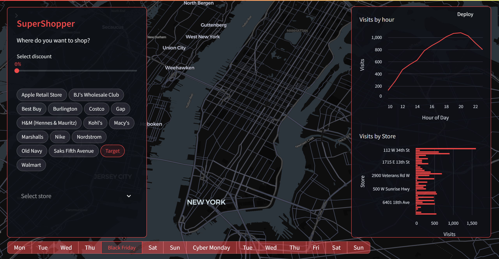

# SuperShopper

This project provides a dashboard for better shopping planning during Black Friday and Cyber Monday. Users can see visitation counts for the whole 2 weeks of Black Friday and Cyber Monday, analyze hourly variations in traffic for each store and brand, and filter data based on discounts offered by stores. The data was normalized for weather conditions to provide accurate insights.

## Data Source
The data was sourced from [deweydata.io](https://deweydata.io) and the data provider is Advan Research. The dataset contains aggregated raw counts of visits to POIs from a panel of mobile devices over a given week, showing how often people visit, how long they stay, where they came from, where else they go, and more.

## Features
- View visitation counts for the whole 2 weeks of Black Friday and Cyber Monday.
- Analyze hourly variations in traffic for each store and brand.
- Filter data based on discounts offered by stores.
- Normalized data for weather conditions to provide accurate insights.

## Technologies Used
- **Python**: For data processing and building the application.
- **Streamlit**: For creating the interactive web application.
- **Pandas**: For data manipulation and analysis.
- **Pydeck**: For creating interactive maps.
- **CSS**: For styling the dashboard and enhancing user experience.

## Hosting
The app is hosted on [supershopper.streamlit.app](https://supershopper.streamlit.app).